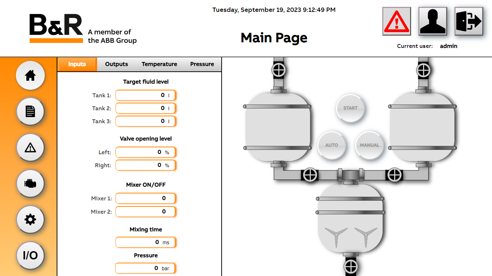
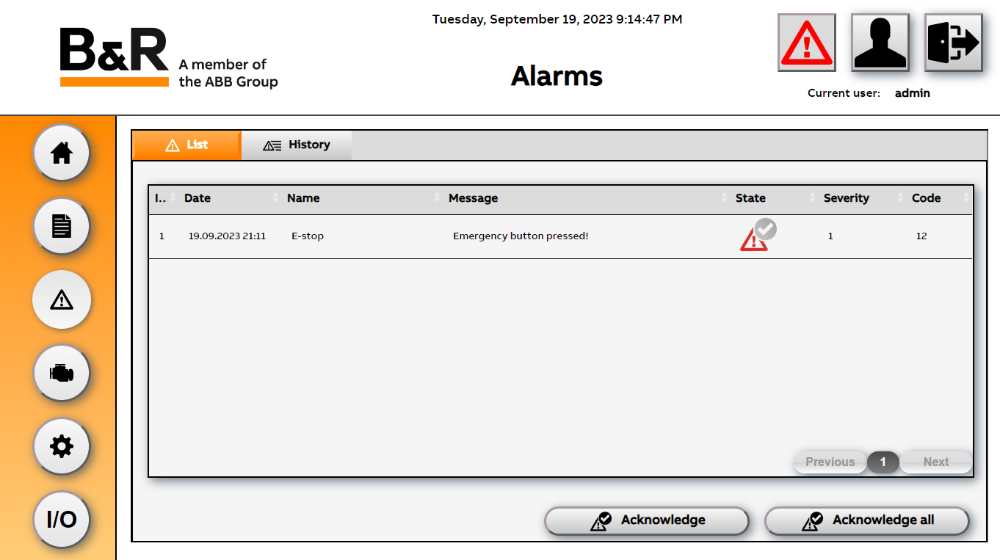
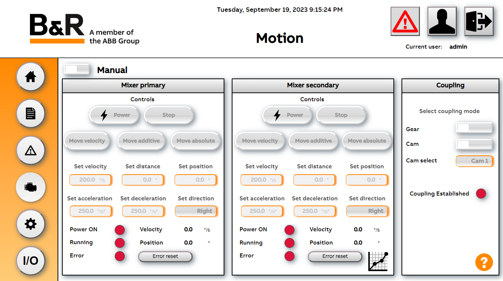
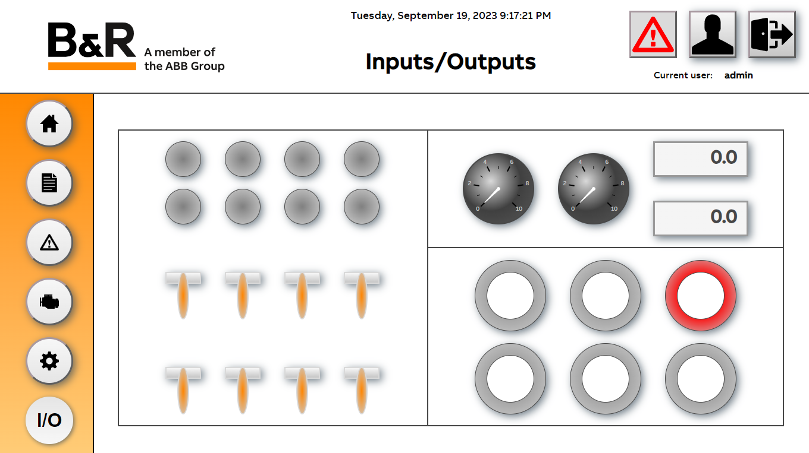

# 🎛️ DemoWall 🚰

## Description 📜
The main goal of the project was to create a program in *Automation Studio* presenting an overview of *B&R* devices. 

The core of the project is a program simulating the system of pouring and mixing liquids in tanks.  
User has insight into the process and can control liquid levels, as well as the temperature and pressure in the main tank. 
Process control devices can operate in manual or automatic mode. 
Some features in system are available only for specific users (operator or admin). 

  

Process parameters can be set manually or loaded from *.xml* recipe file located on PLC memory or USB flash drive. 

  

The operator can also check and confirm various types of alarms. 

  

In order to present the capabilities of *ACOPOSmicro* motor drivers, our project includes a page dedicated to motors control. 

  

Our project includes also inputs/outputs visualization available on I/O page. 

  

In settings page user can change language and metric system or check information about the entire system.

  

For more details see [Documentation](Logical/mappView/Resources/Media/DemoWall_dokumentacja.pdf). 

## Resources 🧰
### Hardware ⚙️
* PLC Controller - X20CP1684
* Expansion modules - X20BB802, X20BC1083, X20PS9400, X20IF1061_1, X20AI2632, X20AO2632, X20DC1396, X20AT2222, X20AP3111, X20DI9371, X20DO9322, X20BT9400, X67BC8321-1
* Safety controller - X20SL8101
* Safety modules - X20SI2100, X20SI9100, X20SC2432, X67SI8103
* Automation Panel - 5AP933.156B-00
* Keypad module X2X - 4XP0000.00-K21
* Synchronous motor driver *ACOPOSmicro* - 80VD100PD.C000-01
* Stepper motor driver *ACOPOSmicro* - 80SD100XD.C044-01
* Synchronous motor - 8LVA22.B1030D000-0
* Stepper motor - 80MPD5.300S014-01
* Temperature sensor - PT1000
* Power supply 24V DC

### Software 💿
* *Automation Studio* 4.12   
* *mapp* technologies 5.23

## Installation 🛠️ 
In order to correctly setup the project it is necessary to:
* **update** *Automation Studio* and mapp components
* **set ip adresses** and subnet masks correctly to avoid conflicts
* **configure** connection via the **NTP** between PC panel and PLC controller

For details see [Documentation](Logical/mappView/Resources/Media/DemoWall_dokumentacja.pdf).

## Documentation 📚

## Team 🤝

     
     
    
      
      

## License 📄
