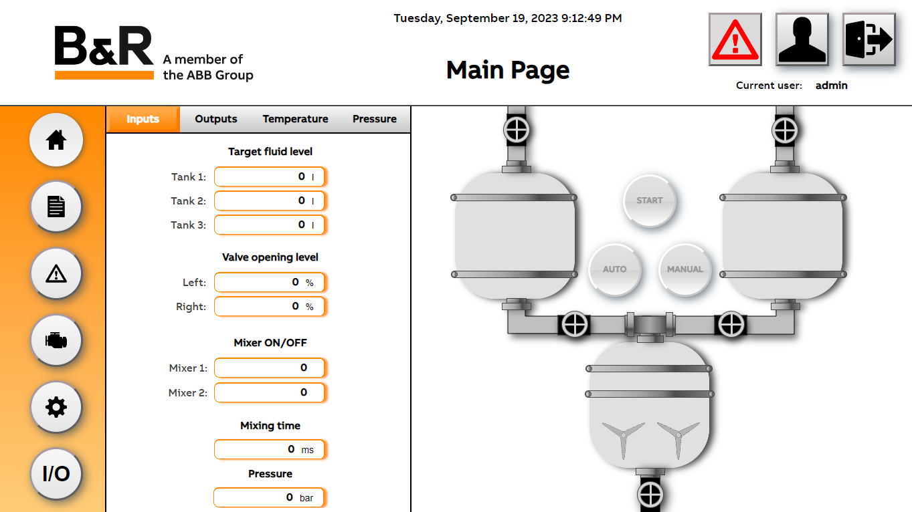
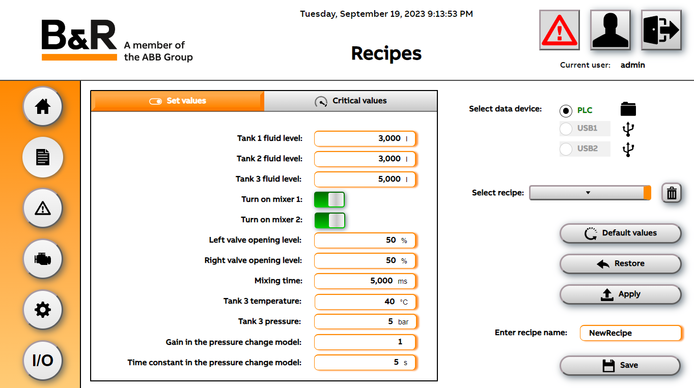
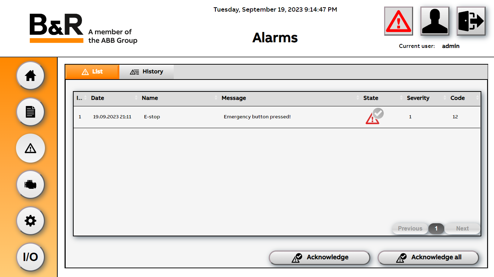
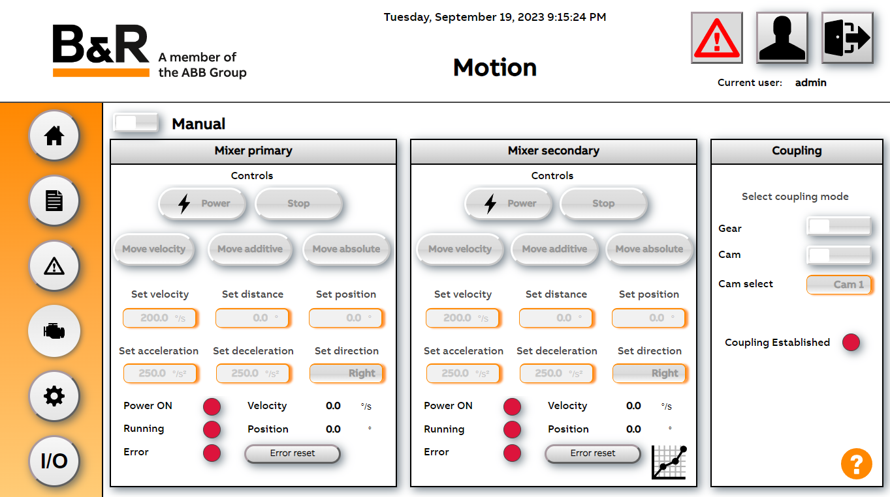
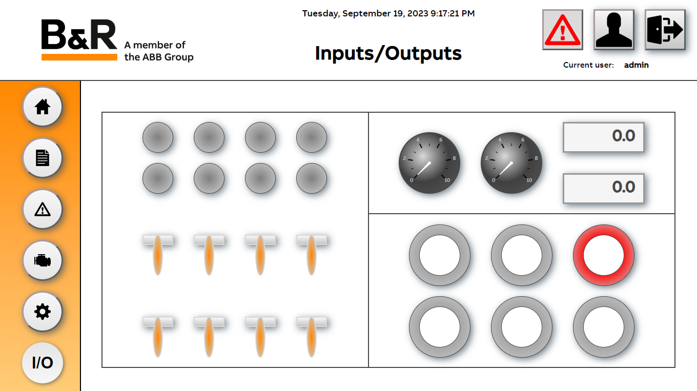
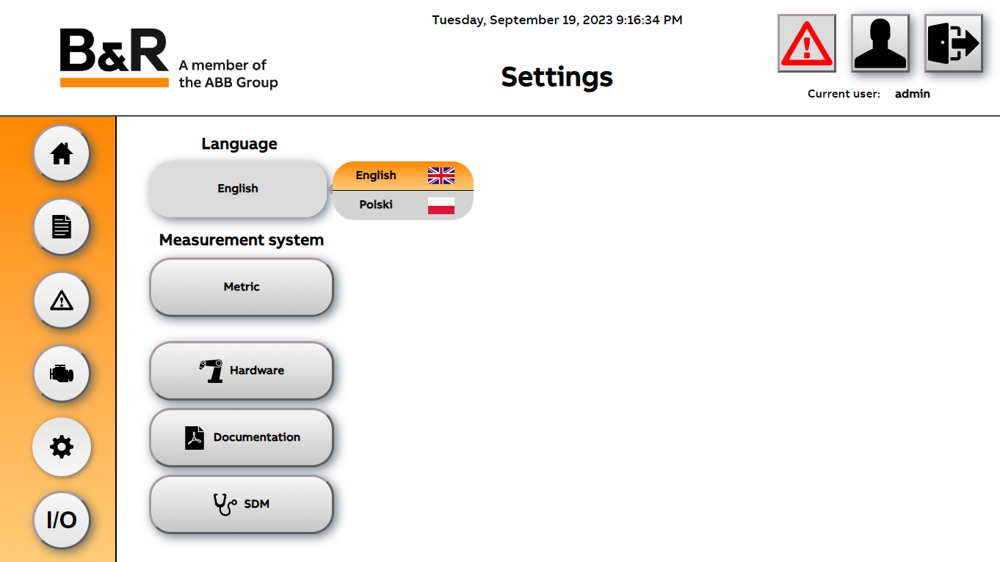

# 🎛️ DemoWall 🚰

## Opis 📜
Głównym celem projektu było stworzenie programu w środowisku *Automation Studio* prezentującego przegląd urządzeń firmy *B&R*. 

Rdzeń projektu stanowi program symulujący działanie systemu napełniania i mieszania cieczy w zbiornikach. 
Użytkownik posiada wgląd w przebieg procesu oraz może kontrolować poziomy cieczy, a także temperaturę i ciśnienie w zbiorniku głównym. 
Urządzenia kontrolujące proces mogą pracować w trybie manualnym lub automatycznym. 
Niektóre funkcje dostępne w systemie zastrzeżone są dla odpowiednich użytkowników (operatora oraz admina). 

  

Parametry procesu mogą zostać ustawione manualnie lub przez wczytanie receptury w formacie *.xml* dostępnej w pamięci sterownika lub z pamięci przenośnej USB. 

  

Operator może także sprawdzać oraz potwierdzać różne typy pojawiających się alarmów.

  

W celu zaprezentowania możliwości serwonapędów *ACOPOSmicro*, nasz projekt zawiera osobną stronę poświęconą sterowaniu dostępnymi napędami. 

  

W wizualizacji zaimplementowana została także strona przedstawiająca działanie wejść/wyjść.   

  

Poprzez stronę z ustawieniami użytkownik ma możliwość zmiany języka oraz systemu miar, a także może sprawdzić informacje dotyczące całego systemu.

  

Szczegóły dostępne w dokumentacji [Dokumentacji](Logical/mappView/Resources/Media/DemoWall_dokumentacja.pdf). 

## Zasoby 🧰
### Sprzęt ⚙️
* Sterownik PLC - X20CP1684,
* Moduły rozszerzeń - X20BB802, X20BC1083, X20PS9400, X20IF1061_1, X20AI2632, X20AO2632, X20DC1396, X20AT2222, X20AP3111, X20DI9371, X20DO9322, X20BT9400, X67BC8321-1
* Sterownik bezpieczeństwa - X20SL8101
* Moduły bezpieczeństwa - X20SI2100, X20SI9100, X20SC2432, X67SI8103
* Dotykowy panel PC - 5AP933.156B-00
* Moduł klawiatury X2X - 4XP0000.00-K21
* Serwonapęd silnika synchronicznego *ACOPOSmicro* - 80VD100PD.C000-01
* Serwonapęd silnika krokowego *ACOPOSmicro* - 80SD100XD.C044-01
* Silnik synchroniczny - 8LVA22.B1030D000-0
* Silnik krokowy - 80MPD5.300S014-01
* Czujnik temperatury - PT1000
* Zasilacz DC 24V

### Oprogramowanie 💿
* *Automation Studio* 4.12   
* technologia *mapp* 5.23

## Instalacja 🛠️ 
W celu poprawnej instalacji projektu na urządzeniu należy:
* **zaktualizować** *Automation Studio* oraz komponenty mapowe do odpowiednich wersji
* **ustawić adresy ip** oraz maski podsieci urządzeń tak, aby uniknąć konfliktów
* **skonfigurować** połączenie przez protokół **NTP** pomiędzy panelem dotykowym, a sterownikiem PLC

Szczegóły dostępne w [Dokumentacji](Logical/mappView/Resources/Media/DemoWall_dokumentacja.pdf).

## Dokumentacja 📚

## Zespół 🤝

     
     
    
      
      

## Licencja 📄
